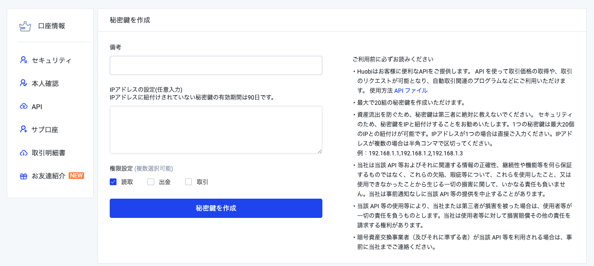

# Huobi Japan API Sample

> Huobi Japan API 的演示用代码, 可以通过这个程序验证API的功能. 可以通过参考相关代码, 快速集成自动交易的程序. 


[API DOC](https://api-doc.huobi.co.jp/#api)

## 如何取得API Key

> 登录后, 可以通过以下界面生成API密钥




## 如何创建程序

> 可以通过以下命令创建不同OS的可执行命令

```bash
# clone code
git clone git@github.com:FireCoinJp/huobi-japan-api-samples.git

# mac
$ go build -o api-test main.go

# linux 
$ GOOS=linux GOARCH=amd64 go build -o api-test main.go

# windows
$ GOOS=windows GOARCH=amd64 go build -o api-test main.go
```

## 如何配置

> 在执行命令的相同文件夹中, 创建`config.yaml`文件, 并输入相关内容

 1. 在项目根目录创建config.yaml文件, 并记录相关内容

 ```bash
 $ mv config.yaml.sample config.yaml
 $ vi config.yaml
 
 setting:
 	access_key: xxxxxx          # 客户的访问密钥
 	secret_key: xxxxxx          # 客户的密钥
 	account_id: 12345678        # 调用accounts子命令可以得到
 	host: api-cloud.huobi.co.jp # 固定值
 	save: false                 # 是否保存结果文件
 	timeout: 10s                # WS持续时间, 默认时间10s
 ```

 2. 如何取得account_id

    > 需要在配置文件中填写用户密钥信息

```bash
$ ./api-test accounts

{
  "data": [
    {
      "id": 1234567,
      "state": "working",
      "subtype": "",
      "type": "spot"
    }
  ],
  "status": "ok"
}
```

## 如何执行

> 本程序为子命令模式, 使用方法如下


```bash
# 查询命令列表

$ ./api-test
Usage: api-test <flags> <subcommand> <subcommand args>

Subcommands:
        commands         list all command names
        flags            describe all known top-level flags
        help             describe subcommands and their syntax

Subcommands for Websocket (Private):
        wsAccounts       資産変動
        wsClearing       注文状態更新
        wsOrder          注文データ

Subcommands for Websocket (Public):
        wsBbo            BBO
        wsDepth          板情報
        wsKline          ローソク足 データ
        wsMarketDetail   マーケット概要
        wsTicker         ティッカー

Subcommands for アカウント関連:
        accounts         ユーザアカウント
        balance          残高照合

Subcommands for ウォレット関連:
        cancel           暗号資産の出金のキャンセル
        create           暗号資産の出金申請
        depositWithdraw  入出金記録

Subcommands for システム情報関連:
        currencys        対応取引通貨
        symbols          取引ペア情報
        timestamp        システム時間を調べる

Subcommands for マーケット関連:
        depth            板情報
        historytrade     取引履歴の取得
        kline            ローソク足
        merge            ティッカー
        tickers          全取引ペアの相場情報
        trade            最新の取引データ

Subcommands for 取引関連:
        batchCancelOpenOrders  条件付き注文の一括キャンセル
        batchcancel      注文の一括キャンセル
        getMatchresults  約定履歴の検索
        getOrder         注文履歴の検索
        matchresults     注文の約定詳細
        openOrders       未約定注文一覧
        order            注文の照会
        place            注文実行
        submitcancel     注文キャンセル

Subcommands for 販売所関連:
        maintainTime     販売所メンテナンス時間
        orderlist        販売所注文履歴
        retailPlace      販売所での注文
        wsDataSubscription  データ購読

   
   
# 查询子命令参数
$ ./api-test help kline
api-test kline 
  -period string
        チャートタイプ (default "1day")
  -size string
        サイズ - default=150 max=2000  (default "20")
  -symbol string
        取引ペア - btceth (default "btcjpy")

# 执行命令
$ ./api-test kline -symbol btcjpy -size 2
{
  "ch": "market.btcjpy.kline.1day",
  "data": [
    {
      "amount": 2.6079233285649943,
      "close": 6903272,
      "count": 13332,
      "high": 6958855,
      "id": 1636128000,
      "low": 6884737,
      "open": 6893137,
      "vol": 18044270.39024
    },
    {
      "amount": 23.07694295966621,
      "close": 6891578,
      "count": 37439,
      "high": 7189999,
      "id": 1636041600,
      "low": 6891578,
      "open": 6938545,
      "vol": 161380835.70746
    }
  ],
  "status": "ok",
  "ts": 1636157137864
}

```


## 验签逻辑 (API & WebSocket)

> 为了确认用户身份和提高安全性, 访问私有API需要进行签名处理. 下面的代码可以解释签名逻辑.

+ Rest API

	>  私有API访问前, 构造签名,并和原有参数一起访问API

```go
// file: core/api/http.go 
func (c Client) Auth(req *http.Request) error {
    authParams := url.Values{}
    // GET API contains request parameters, POST API only contains URI
    if req.Method == http.MethodGet {
        authParams, _ = url.ParseQuery(req.URL.RawQuery)
    }

    // Add fixed parameters
    authParams.Set("AccessKeyId", c.config.AccessKey)
    authParams.Set("SignatureMethod", "HmacSHA256")
    authParams.Set("SignatureVersion", "2")
    authParams.Set("Timestamp", time.Now().UTC().Format("2006-01-02T15:04:05"))
  
    // make a signature
    s := fmt.Sprintf("%s\n%s\n%s\n%s", req.Method, req.URL.Host, req.URL.Path, authParams.Encode())
    signature := crypto.Hmac256(s, c.config.SecretKey)
    authParams.Set("Signature", signature)
    req.URL, _ = url.Parse(fmt.Sprintf("%s://%s%s?%s", req.URL.Scheme, req.URL.Host, req.URL.Path, authParams.Encode()))
    
    req.Header.Set("Content-Type", "application/json")
    return nil
}		
```

+ WebSocket

  > 建立连接后, 发送签名命令, 以便可以订阅或调用websocket私有命令. 签名方法同Rest API

```go
// file : core/ws/websocket.go 
func (w *Client) handleAuth() error {
    // add fixed parameters
    authParams := url.Values{}
    utc := time.Now().UTC().Format("2006-01-02T15:04:05")
    authParams.Set("accessKey", w.config.accessKey)
    authParams.Set("signatureMethod", "HmacSHA256")
    authParams.Set("signatureVersion", "2.1")
    authParams.Set("timestamp", utc)
    
    // make a signature
    host := "api-cloud.huobi.co.jp"
    path := "/ws/v2"
    s := fmt.Sprintf("GET\n%s\n%s\n%s", host, path, authParams.Encode())
    signature := crypto.Hmac256(s, w.config.secretKey)

    // build request json
    param := wsRequest.Param{
        AuthType:         "api",
        AccessKey:        w.config.accessKey,
        SignatureMethod:  "HmacSHA256",
        SignatureVersion: "2.1",
        Timestamp:        utc,
        Signature:        signature,
    }
    auth := wsRequest.AuthJson{
        Action: "req",
        Ch:     "auth",
        Params: param,
    }
    authBody, _ := json.Marshal(auth)
    
    // send command
    return w.WriteMessage(websocket.TextMessage, authBody)
}
```


## 目录结构

```bash
# 本项目的目录结构
$ tree -L 1 

├── Makefile            # 默认命令集合
├── Readme.md      # 说明文档
├── api-test             # 可执行文件
├── cmds                 # 运行代码
├── config               # 配置定义
├── config.yaml.sample  # 配置文件(需要用户自己生成)
├── core                # Library
├── data                # 数据结构定义
├── json                # 保存结果
└── main.go         # 主函数	
```

